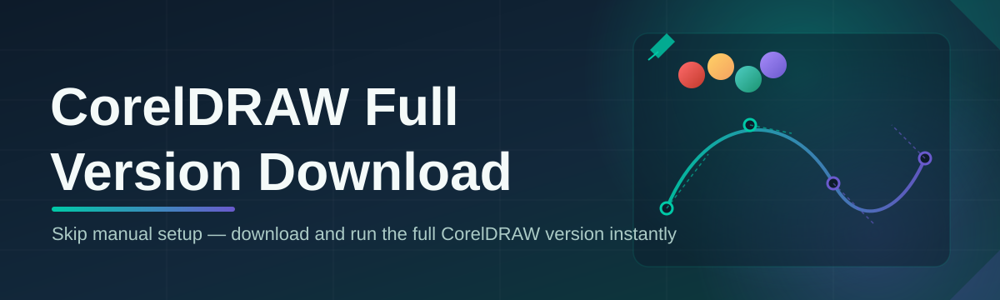

# coreldraw-full-suite 🎨🧭

  

*A stable, self-contained distribution pipeline for getting the full CorelDRAW suite onto your Windows workstation — without the guesswork.*

  

---

## 📐 Overview

**coreldraw-full-suite** is a maintenance-grade landing project built for one purpose: giving designers, print shops, sign makers, and studio teams a predictable, reliable path to a CorelDRAW full version download in 2026. Rather than scattering documentation across forums and outdated blog posts, this repository consolidates the download entry point, the system prerequisites, and the operational guidance into a single, versioned source of truth. It exists because vector design workflows — packaging mockups, large-format signage, technical illustration — depend on tooling that behaves the same way every time it launches, and that consistency starts with how the software is obtained and configured.

This project is aimed at three audiences: independent designers who need a dependable CorelDRAW full version download without chasing broken mirrors; IT administrators provisioning design workstations across a fleet of machines; and studio leads who need a repeatable, documented process they can hand to new hires. Every section below is written with production environments in mind — not casual tinkering. We treat the download and setup process the way an enterprise treats any critical dependency: versioned, reproducible, and boring in the best possible sense.

The suite itself covers the core CorelDRAW toolset — vector illustration, layout, typography, and export pipelines — packaged for Windows 10 and Windows 11. There is no companion cloud service, no background telemetry harvesting, and no bundled toolbars. It is a straightforward path from **landing page** to **working design environment**, and this README documents that path end to end.

> [!NOTE]
> This repository is a landing/documentation project. The actual installer is served from the GitHub Pages link below — always download from that page to guarantee you're on the current, verified build.

## 🚀 Get the Build

  

---

## 🧰 What's Inside the Suite

Each capability below is scoped for real production work, not a checkbox demo.

- **Vector precision engine** — node-level editing with sub-pixel snapping, built for technical illustration and packaging dielines where tolerances actually matter.

- **Layout and page management** — multi-page documents with independent grids and guides, suited to catalogs, brochures, and multi-panel signage runs.

- **Typography control stack** — OpenType feature access, paragraph and artistic text modes, and font substitution handling that keeps legacy files legible.

- **Color-managed export pipeline** — CMYK/RGB profile handling tuned for both commercial print houses and digital-first output.

- **Bitmap-to-vector tracing** — raster conversion tooling for reconstructing logos and scanned artwork into clean, editable paths.

- **Template and asset library** — a starting-point collection of layouts, swatches, and styles so new projects don't begin from a blank canvas.

- **Batch and macro automation** — scriptable repetitive tasks (resizing, exporting, renaming) for teams processing high file volumes.

- **Standalone offline operation** — once installed, the suite runs without a persistent internet dependency, which matters for locked-down studio networks.

> [!TIP]
> If you manage multiple design seats, document your install steps once using the "How It Works" section below and reuse that checklist across every workstation — consistency here saves support tickets later.

---

## 🧭 How to Get Started

1. **Visit the landing page** using the download button above — this is the only supported entry point for the current build.

2. **Download the installer package** for your Windows edition (10 or 11, 64-bit).

3. **Run the setup executable** with standard user permissions; no elevated scripting or manual dependency installs are required.

4. **Launch the suite** from the Start Menu shortcut created during setup, and complete the first-run workspace configuration.

> [!IMPORTANT]
> Always verify you are on `coreldraw-full-suite`'s official landing page before downloading. Third-party mirrors are not maintained by this project and are not covered by any guarantee below.

---

## 🖥️ System Requirements

| Component        | Minimum                          | Recommended                        |
|-------------------|-----------------------------------|-------------------------------------|
| OS                | Windows 10 (64-bit)                | Windows 11 (64-bit)                 |
| Processor         | Dual-core 2.0 GHz                  | Quad-core 3.0 GHz or better          |
| Memory            | 4 GB RAM                           | 16 GB RAM                            |
| Storage           | 3 GB free disk space                | 8 GB free (SSD recommended)          |
| Display           | 1280×720                            | 1920×1080 or higher                  |
| Dependencies      | None — fully standalone package     | None — fully standalone package      |

  

---

## ⚙️ How It Works

The distribution flow is intentionally linear so that every download behaves identically, regardless of machine or team:

1. **Request** — the user opens the landing page and initiates a download request.

2. **Verify** — the page resolves the current stable build reference before serving anything.

3. **Deliver** — the installer package is handed to the browser as a single executable.

4. **Install** — the setup routine unpacks the suite locally with no external dependency calls.

5. **Run** — the application launches directly from the local install, standalone from that point on.

> [!NOTE]
> There is no background installer service and no silent auto-update daemon. Updates are pulled the same way the original CorelDRAW full version download was obtained — through the landing page, deliberately, on your schedule.

---

## 🧩 Common Pitfalls

<strong>The installer window opens but nothing happens for a while — is it frozen?</strong>

Initial setup unpacks a large asset library and can appear idle for 1-2 minutes on spinning-disk storage. Check Task Manager for active disk I/O before assuming a freeze.

<strong>CorelDRAW launches but fonts render incorrectly.</strong>

This is almost always a missing system font dependency. Confirm your Windows font cache isn't corrupted, and reboot once after installation completes — the font cache rebuilds on next launch.

<strong>Export to CMYK looks different from what I see on screen.</strong>

This is expected color-management behavior, not a bug. Your monitor renders RGB; confirm the correct output profile is selected under the export dialog's color settings before finalizing print files.

<strong>The suite won't start after a Windows update.</strong>

Windows updates occasionally reset app permissions. Re-run the installer's repair option (no reinstall needed) — this restores the shortcut and permission bindings without touching your saved files.

<strong>My workstation has an older GPU — will performance suffer?</strong>

Vector rendering is largely CPU-bound in this suite; a modest integrated GPU is generally sufficient. Large bitmap tracing operations benefit most from additional RAM, not GPU power.

<strong>Can I run it on a network drive for shared team access?</strong>

Local installation is strongly recommended. Network-drive execution introduces file-lock and latency issues that are outside this project's guaranteed behavior.

---

## 🎛️ UI, Shortcuts, and Personalization

> The interface favors muscle memory over menu-diving — most production work should be reachable without touching the mouse.

**Default keyboard shortcuts:**

| Action              | Shortcut        |
|---------------------|-----------------|
| New document         | `Ctrl + N`      |
| Node edit tool       | `F10`           |
| Shape tool           | `F6`            |
| Zoom to selection    | `F2`            |
| Export dialog        | `Ctrl + E`      |
| Toggle grid/guides   | `Ctrl + Shift + G` |

**Personalization options:**

- Light, dark, and high-contrast workspace themes
- Dockable tool palettes with saveable custom layouts
- Configurable auto-save interval and backup file retention
- Unit system toggle (mm / inch / px) persisted per document

> [!TIP]
> Save a custom workspace layout once your palettes are arranged the way you like — it persists across updates and new document sessions.

---

## 🤝 Contributing & Community

This project welcomes documentation improvements, troubleshooting entries, and workflow guides from the community. Before opening a pull request:

- Search existing issues to avoid duplicate reports
- Keep documentation changes scoped and factual — this is an enterprise-facing reference, not a changelog dump
- Use clear, reproducible steps when reporting an installation or runtime issue

> [!WARNING]
> Do not submit or request unofficial download mirrors, modified installer packages, or license-circumvention discussion. Issues and PRs containing these will be closed without review.

Community discussion threads, longer-form workflow write-ups, and version history notes live under the repository's Discussions and Issues tabs.

---

## 📄 License

Released under the [MIT License](LICENSE), 2026.

## ⚠️ Disclaimer

This repository is an independent documentation and distribution landing project. It is not officially affiliated with, endorsed by, or sponsored by Corel Corporation. "CorelDRAW" is a trademark of its respective owner. All product names and trademarks referenced here belong to their respective holders and are used solely for identification and descriptive purposes.

---

  

